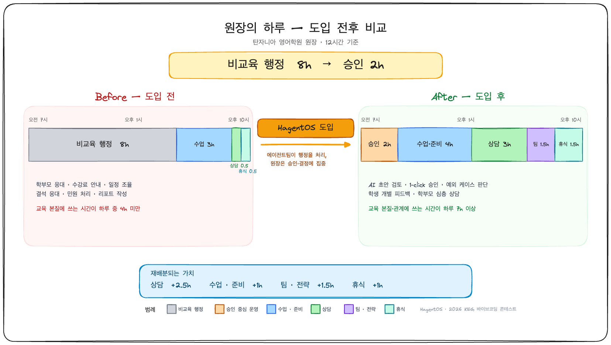
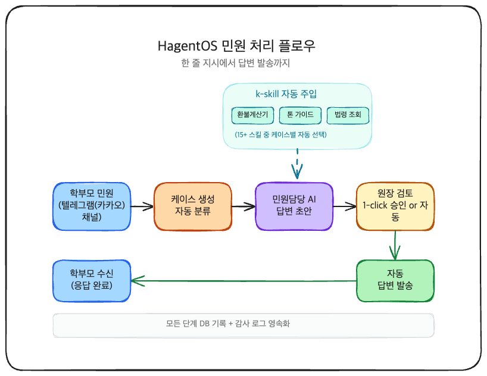
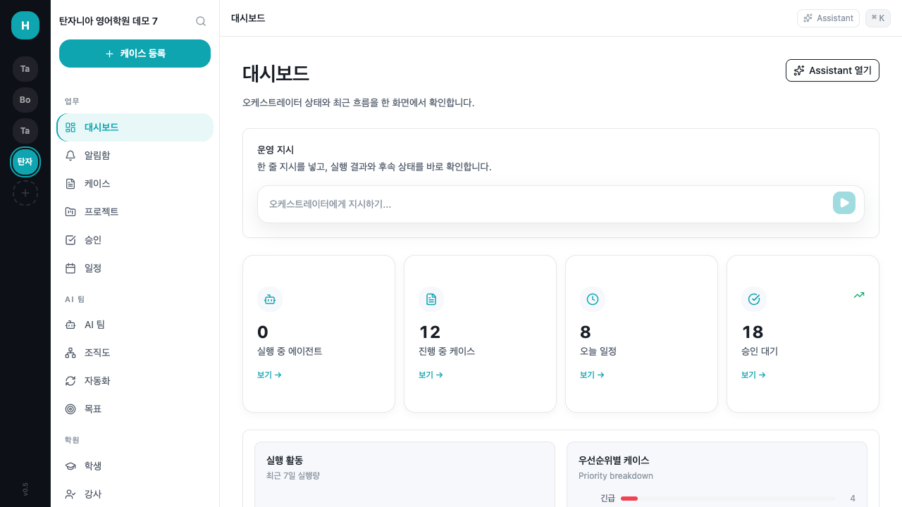
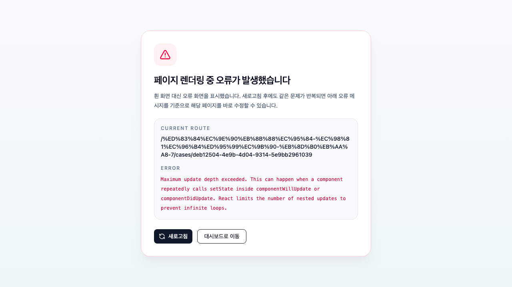
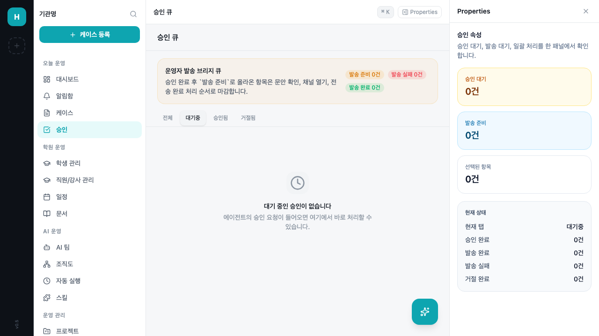
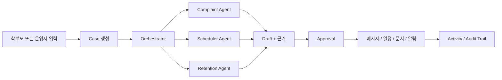
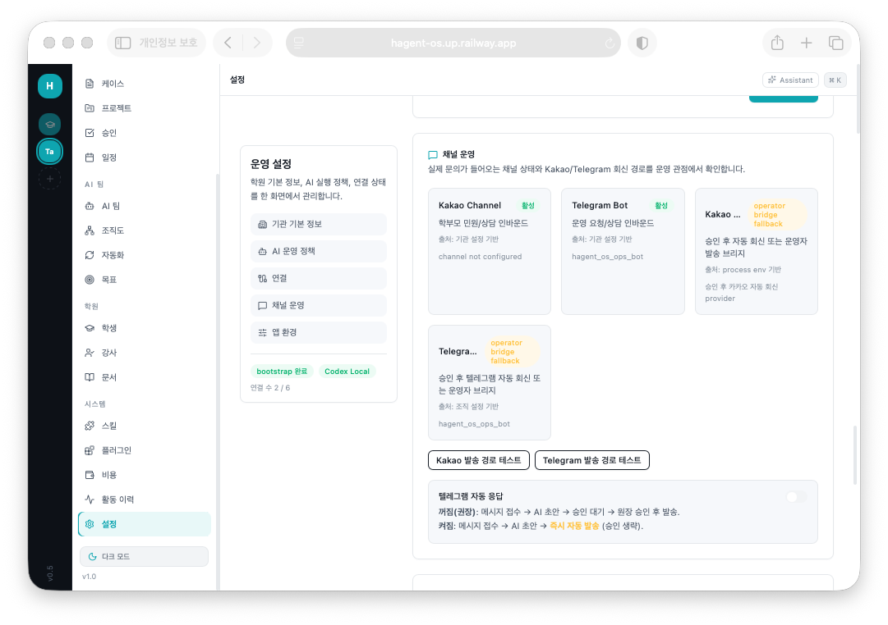
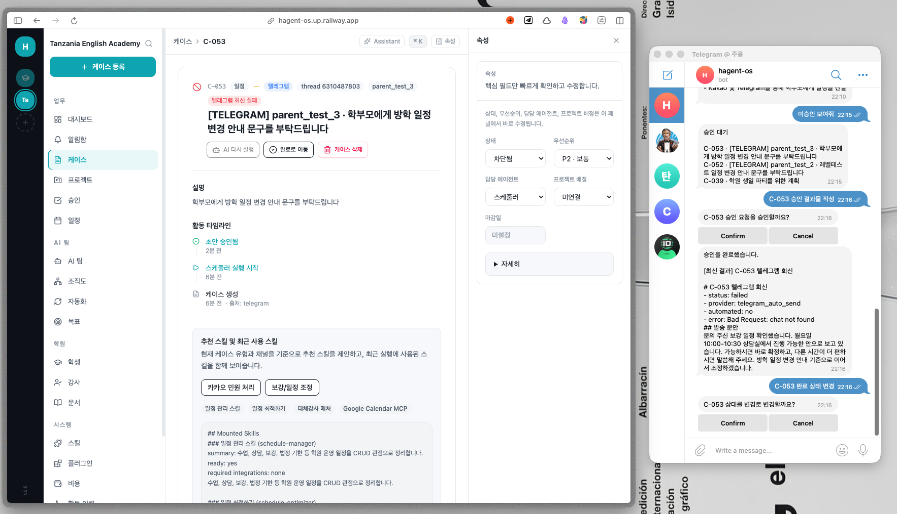
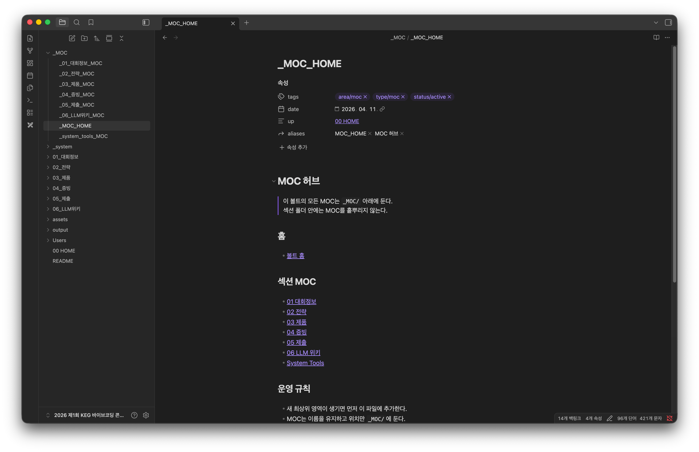
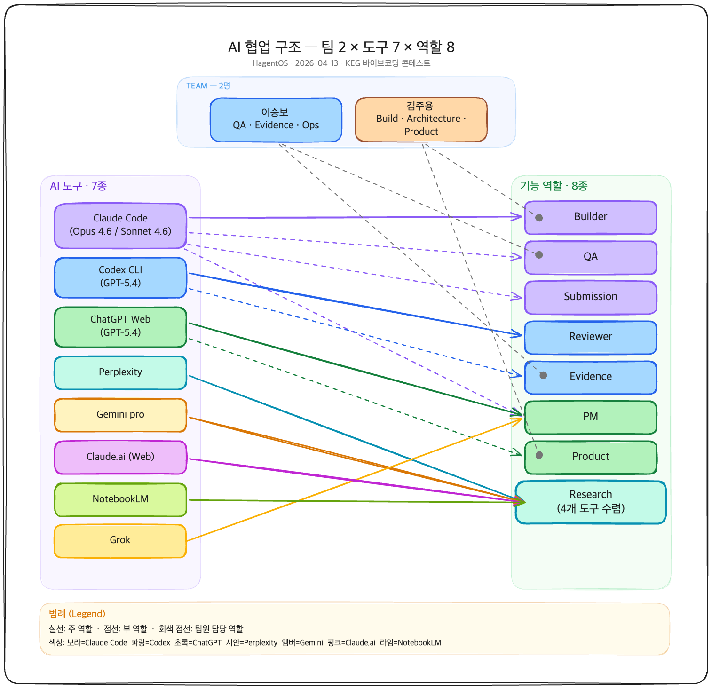

<p align="center">
  
</p>

<p align="center">
  <sub>원장이 비교육 행정에 쓰는 시간을 줄이고, 승인과 판단에 집중하게 만드는 학원 운영 AI 관제판</sub>
</p>

<p align="center">
  <a href="https://hagent-os.up.railway.app/tanzania-english-academy/dashboard"><strong>실서비스 바로가기</strong></a>
  &middot;
  <a href="./JUDGE_DEMO.md"><strong>심사 가이드</strong></a>
  &middot;
  <a href="./docs/JUDGE_EVIDENCE.md"><strong>구현 및 증빙</strong></a>
  &middot;
  <a href="./ROADMAP.md"><strong>로드맵</strong></a>
  &middot;
  <a href="./PRIVACY.md"><strong>개인정보 안내</strong></a>
  &middot;
  <a href="./LICENSE"><strong>MIT 라이선스</strong></a>
  &middot;
  <a href="https://github.com/River-181/hagent-os"><strong>GitHub</strong></a>
</p>

<p align="center">
  <a href="https://t.me/TANZANIA_ENGLISH_ACADEMY_bot"><strong>고객 텔레그램 봇</strong></a>
  &middot;
  <span><strong>운영 텔레그램 봇</strong> 비밀번호 <code>hagent2026</code></span>
  &middot;
  <a href="http://pf.kakao.com/_raDdX"><strong>카카오 채널</strong></a>
</p>

<p align="center">
  <code>React 19</code>
  <code>Express</code>
  <code>PostgreSQL 17</code>
  <code>Claude</code>
  <code>Codex</code>
  <code>Playwright</code>
  <code>Telegram</code>
  <code>Kakao</code>
  <code>Railway</code>
</p>

## 심사위원 30초 시작

이 README를 길게 읽지 않아도, 아래 네 줄만 따라오면 핵심 흐름을 볼 수 있습니다.

1. 웹 대시보드 열기
   `https://hagent-os.up.railway.app/tanzania-english-academy/dashboard`
2. 고객 봇 체험
   `https://t.me/TANZANIA_ENGLISH_ACADEMY_bot`
   보내기: `이번 주 보강 필요한 학생 정리해줘`
3. 운영 봇 체험
   `@hagent_os_ops_bot`
   먼저 보내기: `/login hagent2026`
   그 다음 보내기: `미승인 보여줘`
4. 전체 시연 순서가 필요하면
   [JUDGE_DEMO.md](./JUDGE_DEMO.md)

최종 제출 GitHub URL:
`https://github.com/River-181/hagent-os`

## HagentOS란?

# 학원 운영의 비정형 예외를 승인 가능한 AI 흐름으로 바꾸는 운영 관제판

HagentOS는 한국 학원 운영을 위한 **AI 에이전트 팀 기반 운영 시스템** 입니다.

학부모 문의, 보강 요청, 휴원 안내, 재등록 위험 같은 운영 업무를 `Case -> Agent Draft -> Approval -> Side Effect` 흐름으로 구조화합니다.

겉으로는 메시지와 대시보드가 보이지만, 본질은 **운영 판단을 기록하고 승인 가능한 형태로 제시하는 제품** 입니다. 에이전트 팀이 초안과 근거를 만들고, 사람은 승인과 예외 판단에 집중합니다.

즉, HagentOS는 "메시지 한 건에 답하는 챗봇"이 아니라, **운영 이슈를 끝까지 처리 가능한 단위로 다루는 control plane** 을 지향합니다.

|        | 단계 | 설명 |
| ------ | ---- | ---- |
| **01** | 입력 수집 | 메신저, 운영자 지시, 알림이 `Case` 로 구조화됩니다. |
| **02** | 초안 생성 | Orchestrator와 전문 Agent가 draft와 근거를 만듭니다. |
| **03** | 승인과 후속조치 | 사람이 승인하면 메시지, 일정, 문서, 활동 로그로 이어집니다. |

## 이 제품이 맞는 경우

- 학원 운영 문제를 **단순 챗봇이 아니라 운영 시스템** 으로 풀고 싶을 때
- AI가 자동으로 초안을 만들되 **승인 게이트** 는 유지하고 싶을 때
- Telegram, Kakao, 웹 UI가 하나의 흐름으로 연결된 제품을 보여주고 싶을 때
- 심사자가 짧은 시간 안에 **도메인 적합성 + 구현 완성도 + AI 활용** 을 같이 읽게 만들고 싶을 때
- 메시지 대응 품질을 개인 숙련도와 기억에 덜 의존하게 만들고 싶을 때
- 단순 답변 생성보다 **기록, 승인, 후속조치** 가 남는 구조를 원할 때

## 핵심 기능

<table>
  <tr>
    <td align="center" width="33%">
      <h3>Case 중심 운영</h3>
      대화가 아니라 운영 이슈를 기준으로 기록하고 추적합니다.
    </td>
    <td align="center" width="33%">
      <h3>승인 가능한 자동화</h3>
      AI가 초안과 근거를 만들고, 사람은 승인과 반려를 결정합니다.
    </td>
    <td align="center" width="33%">
      <h3>역할 분리된 에이전트 팀</h3>
      Orchestrator와 전문 Agent가 서로 다른 업무를 맡습니다.
    </td>
  </tr>
  <tr>
    <td align="center">
      <h3>채널 연결</h3>
      Telegram, Kakao, 웹 UI가 하나의 흐름으로 연결됩니다.
    </td>
    <td align="center">
      <h3>후속조치 연결</h3>
      메시지 발송, 일정 생성, 문서 생성, 활동 로그가 결과로 남습니다.
    </td>
    <td align="center">
      <h3>운영 감사 흔적</h3>
      Approval, Timeline, Activity, Artifact로 판단 흔적을 남깁니다.
    </td>
  </tr>
</table>

## 우리가 해결하려는 문제

학원 운영의 진짜 병목은 출결 앱 자체가 아니라 **비정형 예외 처리** 입니다.

- 학부모 문의와 민원이 카카오톡, 텔레그램, 전화, 엑셀에 흩어집니다.
- 원장이 직접 읽고 직접 판단해야 해서 대응 품질이 개인 기억과 숙련도에 의존합니다.
- "답변 생성" 만으로는 부족하고, 실제로는 **승인과 후속조치** 까지 이어져야 합니다.
- 운영 문제가 채널별로 끊겨 있으면 누가 언제 무엇을 결정했는지 추적하기 어렵습니다.
- 반복되는 문의라도 기관 정책, 일정, 학생 상태에 따라 답이 달라져 단순 FAQ 방식이 잘 맞지 않습니다.

HagentOS는 이 문제를 **대화 중심이 아니라 운영 단위 중심의 시스템** 으로 풀려고 했습니다.

## HagentOS가 해결하는 방식

| 기존 방식 | HagentOS 방식 |
| --- | --- |
| 운영 이슈가 카카오톡, 텔레그램, 전화, 엑셀에 흩어집니다. | 모든 운영 이슈가 `Case` 로 남습니다. |
| 원장이 직접 읽고 직접 판단해야 합니다. | 에이전트가 초안과 근거를 만들고, 원장은 승인에 집중합니다. |
| 승인 기록과 후속조치 추적이 어렵습니다. | `Approval`, `Timeline`, `Activity` 로 흐름이 남습니다. |
| 반복 대응 품질이 담당자 기억에 의존합니다. | 정책, 문서, 메모리 기반으로 일관성을 유지합니다. |
| 채널과 운영 보드가 분리되어 있습니다. | Telegram, Kakao, 웹 UI가 하나의 흐름으로 연결됩니다. |

## 심사에서 보여줄 핵심 흐름

심사에서 전달해야 할 핵심 컨셉은 이 한 줄입니다.

`message -> case -> draft -> approval -> side effect`

이 흐름을 조금 더 풀면 아래와 같습니다.

- `message`
  채널이나 운영자 입력이 들어옵니다.
- `case`
  운영 이슈가 구조화된 객체로 저장됩니다.
- `draft`
  에이전트 팀이 초안과 근거를 만듭니다.
- `approval`
  사람이 최종 승인 또는 반려를 결정합니다.
- `side effect`
  메시지 발송, 일정 생성, 문서 생성, 활동 로그 기록으로 이어집니다.

중요한 점은, HagentOS가 단순한 채팅 응답기가 아니라 **운영 흐름 전체를 추적 가능한 상태로 만드는 제품** 이라는 것입니다.

<p align="center">
  
</p>

<p align="center">
  <sub>한 줄 문의가 들어오면 case 생성, AI 초안, 원장 승인, 자동 발송으로 이어지는 흐름을 시각화한 도식</sub>
</p>

## 90초 안에 읽히는 제품 요약

심사자가 짧은 시간 안에 이해해야 할 포인트는 아래 네 가지입니다.

1. 이 제품은 학원 운영 문제를 다룹니다.
2. 입력은 `Case` 로 구조화됩니다.
3. AI는 초안과 근거를 만들고, 사람은 승인합니다.
4. 승인 후에는 실제 후속조치 흔적이 남습니다.

이 네 가지가 보이면, HagentOS의 기획력, 도메인 적합성, AI 활용, 구현 완성도가 함께 읽힙니다.

## 핵심 화면

| Dashboard | Case Detail | Approval Queue |
| --- | --- | --- |
|  |  |  |
| 운영 상태, 위험 학생, 최근 케이스를 한눈에 봅니다. | AI draft, 타임라인, 코멘트, 발송 이력을 케이스 단위로 봅니다. | 승인 대기와 후속 발송 상태를 한 화면에서 확인합니다. |

이 세 장면이 HagentOS의 핵심을 가장 잘 보여줍니다.

- `Dashboard`
  운영 보드라는 제품 포지션을 한눈에 보여줍니다.
- `Case Detail`
  단순 메시지 뷰가 아니라 구조화된 운영 기록이라는 점을 보여줍니다.
- `Approval Queue`
  "완전 자동" 이 아니라 **승인 가능한 자동화** 라는 점을 증명합니다.

## 작동 구조



이 구조 덕분에 HagentOS는 질문응답 앱이 아니라, **운영 판단을 축적하고 승인 가능한 형태로 제시하는 운영 보드** 로 동작합니다.

## 에이전트 팀 구성

| Agent | 역할 |
| --- | --- |
| `Orchestrator` | 요청 분류, 우선순위 판단, 담당 Agent 라우팅 |
| `Complaint` | 민원 분류, 답변 초안, 톤 조절 |
| `Scheduler` | 보강, 일정 변경, 상담 일정 조율 |
| `Retention` | 이탈 위험 감지, 재등록·상담 제안 |
| `Notification` | 발송 시점, 채널 운영, 안내 메시지 정리 |

각 Agent는 역할 정의, 실행 이력, 누적 메모리를 기준으로 동작합니다. 즉, 한 번 답하는 assistant가 아니라 **학원 운영 컨텍스트를 기억하는 팀** 으로 설계했습니다.

## HagentOS가 특별한 이유

| 항목 | 설명 |
| --- | --- |
| **Case 중심 구조** | 대화가 아니라 운영 단위로 기록합니다. |
| **승인 게이트** | 자동화가 아니라 승인 가능한 자동화를 만듭니다. |
| **역할 분리된 에이전트 팀** | 단일 모델이 아니라 역할별 Agent가 협업합니다. |
| **후속조치까지 연결** | 답변에서 끝나지 않고 일정, 발송, 문서, 로그로 이어집니다. |
| **학원 도메인 적합성** | 민원, 보강, 휴원, 재등록 위험 같은 실제 학원 운영 문제를 다룹니다. |
| **운영 제어 채널 분리** | 고객 입력 채널과 원장 제어 채널을 분리해 설계했습니다. |

## HagentOS가 아닌 것

| 구분 | 설명 |
| --- | --- |
| **단순 챗봇이 아닙니다.** | 질문응답만 하는 assistant가 아닙니다. |
| **범용 자동화 빌더가 아닙니다.** | 모든 산업용 파이프라인 도구가 아니라 학원 운영 control plane 입니다. |
| **학교 ERP 전체 대체제가 아닙니다.** | 출결, 수납, 회계 전체를 대체하려는 제품은 아닙니다. |
| **혼자 일하는 단일 봇 장난감이 아닙니다.** | 역할이 나뉜 agent team 과 approval 구조가 핵심입니다. |

## 실서비스와 채널

- 심사 진입 URL: `https://hagent-os.up.railway.app/tanzania-english-academy/dashboard`
- 서비스 기본 URL: `https://hagent-os.up.railway.app`
- 심사 가이드: [JUDGE_DEMO.md](./JUDGE_DEMO.md)
- 구현 및 증빙: [docs/JUDGE_EVIDENCE.md](./docs/JUDGE_EVIDENCE.md)
- 공개 로드맵: [ROADMAP.md](./ROADMAP.md)
- 개인정보 안내: [PRIVACY.md](./PRIVACY.md)
- 라이선스: [LICENSE](./LICENSE)
- 카카오 채널: `pf.kakao.com/_raDdX`

텔레그램은 두 역할로 나뉩니다.

- 고객 응대 봇: `@TANZANIA_ENGLISH_ACADEMY_bot`
  학부모 문의 수신, inbound 생성, case 시작
- 운영·원장 제어 봇: `@hagent_os_ops_bot`
  `/login hagent2026` 인증 후 `미승인 보여줘`, `케이스 승인`, `Confirm / Cancel` 같은 운영 명령 처리

위 두 계정 구조는 제출 직전 라이브 검증 메모 기준으로 정리했습니다. 즉, HagentOS는 "고객 채널" 과 "운영 제어 채널" 을 분리해 설계한 점도 중요한 포인트입니다.

중요한 점:

- 심사자가 **직접 체험해야 하는 공개 채널** 은 고객 응대 봇과 웹 UI입니다.
- 운영 봇도 공개 데모 비밀번호 `hagent2026` 으로 직접 확인할 수 있습니다.
- 운영 봇에 들어가면 `/start`, `도움말`, 또는 아무 owner-control 요청에서 로그인 안내를 다시 받을 수 있습니다.
- 공개 데모는 마스킹·예시 데이터를 기준으로 준비했으며, 실제 개인정보 입력은 권장하지 않습니다.

## 라이선스와 개인정보 안내

이 저장소는 [MIT License](./LICENSE) 기준으로 공개합니다.

다만 공개 심사 환경은 오픈소스 코드 저장소이면서 동시에 라이브 데모이기도 하므로, 개인정보 안내를 별도로 분리해 두었습니다.

- 라이선스: [LICENSE](./LICENSE)
- 개인정보 안내: [PRIVACY.md](./PRIVACY.md)

핵심 원칙은 아래와 같습니다.

- 공개 데모는 seeded data와 마스킹된 예시 데이터를 우선 사용합니다.
- 고객/운영 봇과 웹 UI에서는 시연에 필요한 최소 정보만 다룹니다.
- 실제 학생 개인정보, 연락처, 건강정보, 결제정보 같은 민감정보는 입력하지 않는 것을 전제로 합니다.
- 공개 데모 입력은 Telegram, Kakao, Railway, Anthropic Claude API 같은 외부 서비스 경로를 지날 수 있습니다.

즉, 심사자는 제품 흐름을 충분히 체험할 수 있지만, 실서비스 운영용 정식 개인정보처리방침과는 다른 **공개 데모 안내 문서** 를 보고 있다고 이해하면 됩니다.

<p align="center">
  
</p>

<p align="center">
  <sub>카카오와 텔레그램을 설정 화면 안에서 운영 상태별로 관리하는 실제 제품 화면</sub>
</p>

## 심사에서 가장 강한 시연 순서

README만 보고도 심사 흐름이 떠오르도록, 가장 강한 시연 순서를 적어 둡니다.

1. `Dashboard` 에서 운영 관제판이라는 인상을 줍니다.
2. `Cases` 에서 실제 운영 이슈가 구조화된 객체라는 점을 보여줍니다.
3. `Approvals` 에서 승인 게이트를 보여줍니다.
4. 고객 텔레그램 봇에서 입력을 한 번 보여줍니다.
5. 필요하면 운영 봇에서 `/login hagent2026` 후 승인 장면을 시연합니다.
6. 다시 웹으로 돌아와 `Case`, `Approval`, `Activity`, `Document` 반영을 확인합니다.

즉, 심사 장면도 아래 한 줄로 정리됩니다.

`입력 -> case -> draft -> approval -> 결과`

<p align="center">
  
</p>

<p align="center">
  <sub>운영 봇에서 공개 데모 비밀번호로 로그인한 뒤 승인 명령을 내리고, 웹에서 case와 승인 상태를 함께 확인하는 시연 장면</sub>
</p>

## 우리가 어떻게 일했는가

이 저장소는 제품 소개만 하는 문서가 아니라, **우리가 실제로 어떤 방식으로 만들고 다듬었는가** 를 함께 보여주도록 구성했습니다.

이번 작업의 기본 원칙은 아래 세 가지였습니다.

1. `Pain`
   실제 학원 운영의 예외 처리 문제를 먼저 정의한다.
2. `Workflow`
   그 문제를 `message -> case -> draft -> approval -> side effect` 흐름으로 푼다.
3. `Proof`
   화면, 채널, 검증 문서, handoff 메모로 증명한다.

그래서 README도 단순 기능 목록이 아니라, **문제 -> 흐름 -> 증거** 순서로 읽히도록 설계했습니다.

### Obsidian을 이렇게 활용했습니다

<p align="center">
  
</p>

Obsidian은 단순 메모 도구가 아니라, 이번 프로젝트의 **운영실** 역할을 했습니다.

- 문제 정의 문서
  학원 운영 pain point, 도메인 시나리오, 심사 포인트를 정리했습니다.
- 제품 구조 문서
  `Dashboard`, `Cases`, `Approvals`, `Agents`, `Channels` 가 어떤 흐름으로 연결되는지 정리했습니다.
- 증빙 원장
  무엇을 구현했고 무엇을 검증했고 무엇이 남았는지 누적 기록했습니다.
- 제출 패키지 관리
  README, AI 리포트, 체크리스트, 심사 시나리오를 한데 묶어 관리했습니다.
- 일일 로그
  매일 어떤 결정을 내렸고 어떤 리스크를 처리했는지 남겼습니다.

즉, Obsidian은 "예쁘게 정리한 노트" 가 아니라, **기획과 구현과 검증을 하나로 연결하는 작업 허브** 였습니다.

### 함께 사용한 도구와 역할

| 도구 | 역할 |
| --- | --- |
| `Claude Code` | 구현 보강, 문서 정리, 회귀 대응, 제출 패키지 보완 |
| `Codex` | 저장소 점검, README/JUDGE/AGENTS 구조 재설계, 심사용 문서 품질 개선 |
| `Anthropic Claude API` | 실제 제품의 AI draft와 reasoning 흐름 |
| `Playwright` | 화면 흐름 점검, 시연 경로 검증, 기능 확인 |
| `Obsidian` | 기획, 전략, 증빙, 제출 문서, 작업 로그 연결 |

도구를 나열하는 것보다 중요한 점은, 이 도구들을 **역할별로 나눠 같은 목표를 향해 사용했다** 는 것입니다.

<p align="center">
  
</p>

<p align="center">
  <sub>사람 2명과 여러 AI 도구를 QA, 증빙, 제품, 빌드 역할로 나눠 운영한 협업 구조</sub>
</p>

### 실제 작업 흐름

우리가 작업한 방식은 대략 아래 순서였습니다.

1. Obsidian에서 pain point, 심사 메시지, 핵심 시연 흐름을 정리합니다.
2. 저장소 코드와 화면을 그 흐름에 맞게 보강합니다.
3. Claude Code / Codex로 코드와 문서를 반복적으로 정리합니다.
4. Playwright와 handoff 문서로 흐름을 검증합니다.
5. README, JUDGE_DEMO, 증빙 문서로 심사용 내러티브를 다시 구성합니다.

즉, 이 프로젝트는 단순히 코드를 많이 친 결과물이 아니라, **문제 정의 -> 구현 -> 검증 -> 제출 서사 설계** 가 연결된 작업이었습니다.

## 구현 및 검증 요약

`docs/handoff/2026-04-13-master-evidence.md` 기준 핵심 사실은 아래와 같습니다.

- `server typecheck` 통과
- `ui typecheck` 통과
- 온보딩, Students, `channel -> case`, `approval -> schedule`, `quick-ask -> document`, `routine trigger` 흐름 검증
- 비용 요약 집계 가능
- 외부 연동은 `live / fallback / missing` 관점으로 설명 가능

심사자가 제품만 보는 것이 아니라 **이 팀이 실제로 만들고 다듬었다** 는 점까지 읽게 하려면 [docs/JUDGE_EVIDENCE.md](./docs/JUDGE_EVIDENCE.md) 를 함께 보는 구성이 좋습니다.

## 빠른 시작

### 준비 사항

- `Node.js >= 20`
- `pnpm`
- `.env.example` 을 기반으로 한 `.env`
- 실제 AI와 연동하려면 `ANTHROPIC_API_KEY`
- 실제 DB를 쓰려면 `DATABASE_URL`

### 가장 빠른 실행

```bash
git clone https://github.com/River-181/hagent-os.git
cd hagent-os
cp .env.example .env
pnpm install
pnpm dev
```

기본 로컬 주소:

- UI: `http://127.0.0.1:5174`
- API: `http://127.0.0.1:3200`

### 데모 모드 예시

```bash
DEMO_MODE=true
PORT=3200
```

`DEMO_MODE=true` 이면 심사용 seeded flow를 빠르게 확인하기 좋습니다.

### 실제 AI 연결 모드 예시

```bash
ANTHROPIC_API_KEY=sk-ant-...
DATABASE_URL=postgresql://...
DEMO_MODE=false
PORT=3200
```

## 자주 묻는 질문

- **Q. 실서비스와 로컬 데모는 어떻게 다른가요?**
  실서비스는 Railway에 올라간 배포본이고, 로컬은 `pnpm dev` 기준 개발 실행입니다. 심사에서는 실서비스를 먼저 보여주되, 필요하면 로컬을 fallback으로 사용할 수 있습니다.

- **Q. 왜 텔레그램 봇이 두 개인가요?**
  고객 문의 수신용 채널과 운영·원장 제어용 채널을 분리했기 때문입니다. 고객 입력과 내부 승인 명령을 같은 채널에 섞지 않으려는 설계입니다.

- **Q. 공개 데모에 실제 개인정보를 넣어도 되나요?**
  권장하지 않습니다. 공개 데모는 마스킹·예시 데이터 중심의 심사용 환경입니다. 실제 학생 정보, 연락처, 건강정보, 결제정보는 입력하지 않는 것을 원칙으로 하며 자세한 내용은 [PRIVACY.md](./PRIVACY.md)를 봐 주세요.

- **Q. `DEMO_MODE=true` 면 무엇이 달라지나요?**
  시연용 seeded data와 일부 mock 기반 응답으로 흐름 확인이 쉬워집니다. 제품 구조와 화면 연결을 빠르게 보여주기 위한 설정입니다.

- **Q. 외부 연동이 일부 비활성 상태여도 설명 가능한가요?**
  가능합니다. 이 저장소는 `live / fallback / missing` 상태를 구분해서 설명하는 방식을 따릅니다. 즉, 완전한 연동이 아니어도 무엇이 동작하고 무엇이 fallback인지 말할 수 있어야 합니다.

## 개발과 검증

### 자주 쓰는 명령

```bash
pnpm dev
pnpm dev:server
pnpm dev:ui
pnpm typecheck
pnpm build
cd ui && npx vite build
cd ui && npx tsc --noEmit
```

### 심사용 로컬 확인 순서

1. `pnpm dev`
2. `http://127.0.0.1:5174` 접속
3. `Dashboard -> Cases -> Approvals` 확인
4. 필요하면 텔레그램 또는 카카오 흐름 점검

### 문서만 바꿨을 때 확인

```bash
git diff --check
```

### UI를 바꿨을 때 확인

```bash
cd ui && npx tsc --noEmit
cd ui && npx vite build
```

### 전체 타입 및 빌드 확인

```bash
pnpm typecheck
pnpm build
```

## 저장소를 심사용으로 읽는 순서

심사자나 협업자가 저장소에 처음 들어오면 아래 순서로 보면 됩니다.

1. [README.md](./README.md)
2. [JUDGE_DEMO.md](./JUDGE_DEMO.md)
3. [docs/JUDGE_EVIDENCE.md](./docs/JUDGE_EVIDENCE.md)
4. [ROADMAP.md](./ROADMAP.md)
5. [AGENTS.md](./AGENTS.md)
6. [PRIVACY.md](./PRIVACY.md)
7. [LICENSE](./LICENSE)

이 순서는 제품 이해 -> 시연 흐름 -> 작업 증빙 -> 향후 계획 -> 운영 규칙 -> 공개 정책 순서입니다.

## 저장소 구성

```text
hagent-os/
├── ui/               React UI
├── server/           Express API + orchestration
├── packages/db/      Drizzle schema
├── packages/shared/  shared types
├── docs/             디자인, 증빙, 심사 문서
├── integrations/     외부 연동 실험
├── JUDGE_DEMO.md     심사 시연 스크립트
├── ROADMAP.md        공개용 제품 로드맵
├── PRIVACY.md        공개 데모 개인정보 안내
├── LICENSE           MIT 라이선스
├── AGENTS.md         저장소 운영 규칙
└── README.md         심사자용 진입 문서
```

조금 더 구체적으로 보면 아래가 중요합니다.

- `ui/src/pages/`
  `Dashboard`, `Cases`, `Approvals`, `Agents`, `Settings` 같은 주요 페이지
- `server/src/routes/`
  채널, 케이스, 승인, 조직 설정 관련 API
- `server/src/services/`
  AI 초안 생성, telegram owner control, outbound 처리 같은 비즈니스 로직
- `docs/handoff/`
  검증 메모, 세션 메모, 최종 로드맵 같은 작업 증빙

## 로드맵

자세한 내용은 [ROADMAP.md](./ROADMAP.md)를 보시면 됩니다. README에서는 방향만 짧게 정리합니다.

### 1단계. 심사 흐름 고정

- `Dashboard -> Cases -> Approvals` 흐름을 흔들리지 않게 고정
- 고객 bot / 운영 bot 역할 분리 명확화
- seeded flow와 live input 설명 정리

### 2단계. 운영 채널과 실서비스 완성도 강화

- Telegram / Kakao / owner control 안정화
- `approval -> schedule / outbound / document / activity` 추적성 강화
- fallback 상태를 더 명확하게 표현

### 3단계. 학원 운영 control plane 확장

- 더 많은 정책·운영 문서 기반 답변
- 재등록 위험, 민원, 일정 충돌 같은 예외 처리 고도화
- 운영 메모리와 인사이트 강화

## 현재 한계

- `DEMO_MODE=true` 에서는 일부 AI 응답이 mock 기반입니다.
- 실채널 품질은 로컬 설정과 채널 상태에 따라 달라질 수 있습니다.
- 일부 외부 연동은 안전을 위해 승인 게이트를 둔 상태입니다.
- 라이브 환경이 불안정할 때는 `Dashboard -> Cases -> Approvals` seeded flow를 먼저 보여주는 것이 안전합니다.
- 일부 법률·외부 시스템 조회는 `cached fallback` 으로 보일 수 있습니다.

## 함께 보면 좋은 문서

- [JUDGE_DEMO.md](./JUDGE_DEMO.md)
- [docs/JUDGE_EVIDENCE.md](./docs/JUDGE_EVIDENCE.md)
- [ROADMAP.md](./ROADMAP.md)
- [AGENTS.md](./AGENTS.md)
- [docs/design/ui-harness.md](./docs/design/ui-harness.md)

## 한 줄 정리

HagentOS는 "AI가 답한다" 에서 멈추지 않고, **학원 운영의 비정형 예외를 구조화하고 승인 가능한 흐름으로 바꾸는 AI 운영 관제판** 입니다.
